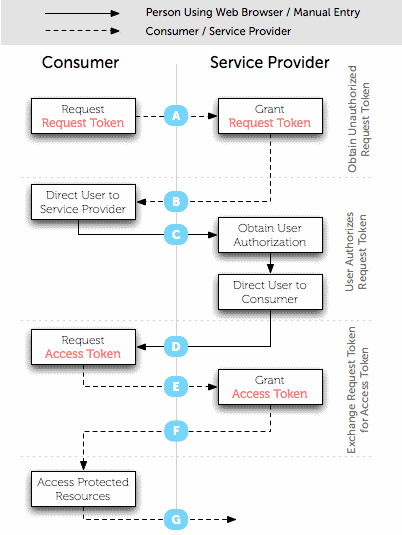
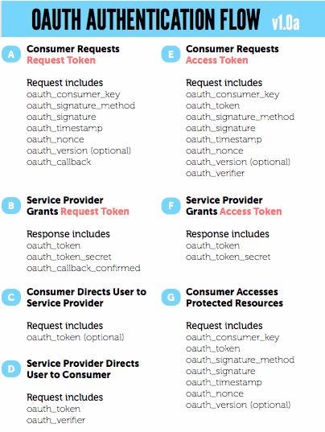

# TweetWX - post weather updates to Twitter using OAuth

# This script is deprecated -- do not install

With changes to Twitter API terms/conditions, this script no longer works.  The built-in APPid for TweetWX was suspended on 13-Jun-2023 and cannot be reactivated.  If you had installed this, I suggest you discontinue the cron jobs using it as it will no
longer function. Sorry!

# do not install

This set of scripts can be used to post status updates to your Twitter account for current weather conditions, weather forecasts, or advisories. It is currently set up to work with WeatherDisplay and the Saratoga templates, and the NOAA NWS forecast service.  
The script uses [OAuth](http://dev.twitter.com/pages/auth#intro) as all Twitter applications must use OAuth for authentication.

The OAuth process is more complicated than the old user:pass basic authentication. It's overall actions are shown in the diagram below:





This package has two setup functions that serve to obtain a durable access token/access token secret for the application to securely update your Twitter status with conditions from WD and forecasts from NOAA/NWS.  
My thanks to Joe Chung who wrote a simple OAuth/Twitter set of functions [documented on his blog](http://nullinfo.wordpress.com/oauth-twitter/) and these scripts are based on his code.

## Requirements:

*   These scripts need **PHP5+** to run. They will **not** run on PHP4.
*   You will need a valid [Twitter](https://twitter.com/) account to receive the postings.
*   These scripts assume you have the [WD/AJAX/PHP template](https://saratoga-weather.org/wxtemplates/index.php) running on your website being updated by [Weather-Display](https://www.weather-display.com/) software. (Conditions tweet is based on the _testtags.php_ data)
*   The TweetWX-forecast.php script uses the NOAA NWS forecast from [advforecast2.php](scripts-carterlake.php#advforecast) (WD-USA template set)
*   **Note:** if your site is running on **GoDaddy** linux hosting, you need to make a change in **TweetWX-global.php** in the function _do_post()_. Change the verify host and verify peer to FALSE (i.e.):  

    CURLOPT_SSL_VERIFYHOST => false,  
    CURLOPT_SSL_VERIFYPEER => false,  

    since their cURL does not currently support the verify host/peer options.  
    Thanks to Jason at [kswxlink.com](http://kswxlink.com/) for this discovery.

## Setup

1.  Download the distribution .zip file, unpack it preserving directory structure, and upload contents to your weather website.
2.  **(optional)** Register your copy of the application with Twitter at [http://twitter.com/oauth_clients/new](http://twitter.com/oauth_clients/new) using your Twitter account.  
    This is optional as you can use the built-in credentials for the application based on my Twitter application registration for TweetWX.  
    If you do your own registration, then copy the _consumer key_ and _consumer secret key_ values into the TweetWX-common.php values at the top of the page. Then save and upload the modified _TweetWX-common.php_ file.
3.  Run **TweetWX-setup1.php** on your website.  
    It will produce a page with two OAuth request values that must be copied into TweetWX-setup2.php and a link to Twitter to allow connection of the TweetWX app to your twitter account.  

    1.  Click on the link and Twitter will ask you to sign-in, then ask permission for TweetWX to be allowed access to your account.
    2.  If you agree, that will produce a Twitter page with a verification number, and that number needs to be copied into the proper variable inside of TweetWX-setup2.php.Update TweetWX-setup2.php with the two request keys and the verification number from Twitter and  
    upload the modified TweetWX-setup2.php to your website.
4.  Run **TweetWX-setup2.php** on your website. It will produce two keys as copy code.  
    These keys are to be copied into the top of _TweetWX-conditions.php_ and _TweetWX-forecast.php_ replacing the values there.  
    These OAuth credentials do not expire (AFAIK) and using them allows the script(s) to post to your Twitter account status.  
    **Keep these access keys secret** .. **they are similar to your user:pass on the old basic authentication scheme and allow read/write to your Twitter account.**
5.  Modify _TweetWX-conditions.php_ to insert the keys from your run of TweetWX-setup2.php (in step 4), and also change the directory pointer to where your _testtags.php_ is located (use relative FILE addressing).
6.  Modify _TweetWX-forecast.php_ to insert the keys from your run of _TweetWX-setup2.php_ (in step 4) and also change the directory point to where your _advforecast2.php_ script is located (relative file addressing)

If you want to redo your OAuth keys, then start at step (3) and proceed through step (6). I don't know how long the interim keys last, so make sure you do step (3) followed shortly by step (4). Once step (4) is completed, you can take as long as you like to do steps (5) and (6).

## Operation on your website

The best and most reliable method to execute the scripts on your website is via cron as a cronjob. Make sure you invoke PHP5 to run the scripts. I've found that a simple shell script makes running the cron job easier as you can set the home directory (etc).  
Something like cron-TweetWX-conditions.sh:

<div class="codebox">

```
#!/bin/bash
cd /my/home/directory/on/webserver/TweetWX
# Clean out old copies if any
ps auxw | grep "TweetWX-conditions.php" | grep -v 'grep' | awk '{print $2}' | xargs kill >/dev/null &2>1
/usr/bin/php5 -q TweetWX-conditions.php > TweetWX-conditions.tmp
cp TweetWX-conditions.tmp TweetWX-conditions.html
#
```

Which will run the script and save the last output into TweetWX-conditions.html so you can follow the progress of the last execution.  
Don't forget to _chmod +x_ the script above (after changing the _cd_ statement for your website document root). A crontab entry of
```
4 * * * *  /my/home/directory/on/webserver/cron-TweetWX-conditions.sh</pre>
```

works to tweet my conditions at 4 minutes after the hour, 24 times a day. I use a similar script for the forecasts, but the schedule is for execution by cron as 47 past the hour at 3,6,10,15,18 and 22h:

```
47 3,6,10,15,18,22 * * *  /my/home/directory/on/webserver/cron-TweetWX-forecast.sh</pre>
```

If you don't happen to have cron available on your webhoster, then you can configure Weather-Display to do HTML downloads on the TweetWX-conditions.php and TweetWX-forecast.php webpages from your website. Use WD, Control Panel, FTP & Connections, HTTP Download TAB. You have 3 setups you can use, so you can have one run hourly for your conditions and a different one run every 4 hours for your forecasts.
